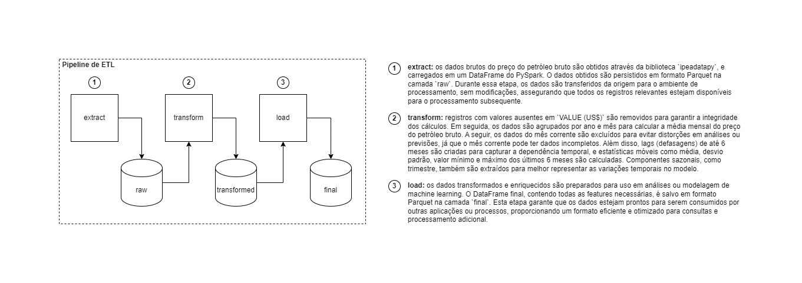

# Arquitetura da Solução

## Importância do Desenho da Arquitetura da Solução

O desenho da arquitetura da solução é uma etapa crucial no desenvolvimento de qualquer projeto de Engenharia de Machine Learning, especialmente quando se trata da implementação de um processo de ETL (Extract, Transform, Load). A arquitetura define a estrutura e o fluxo de trabalho que serão seguidos, garantindo que todas as necessidades de dados, processamento e armazenamento sejam atendidas de maneira eficiente e escalável.

### Por que a Arquitetura é Importante?

1. **Clareza e Alinhamento**: Uma arquitetura bem definida fornece uma visão clara de como os componentes do sistema se interconectam, facilitando o alinhamento entre as equipes técnicas e de negócios. Isso é fundamental para assegurar que os requisitos levantados junto aos stakeholders sejam corretamente traduzidos em uma solução técnica.

2. **Eficiência e Otimização**: Com uma arquitetura planejada, é possível otimizar o uso de recursos, como poder de processamento e armazenamento de dados, reduzindo custos e aumentando a performance do sistema. Além disso, uma arquitetura bem pensada permite que processos sejam automatizados e escaláveis.

3. **Gerenciamento de Riscos**: Ao desenhar a arquitetura, é possível identificar e mitigar riscos antecipadamente, como problemas de integração entre diferentes sistemas, falhas de segurança, ou gargalos de desempenho.

4. **Facilidade de Manutenção e Escalabilidade**: Uma boa arquitetura facilita a manutenção e a atualização da solução ao longo do tempo. Isso é especialmente importante em ambientes de Machine Learning, onde os modelos e os dados estão em constante evolução.

### Principais Componentes da Arquitetura de ETL

Ao desenhar a arquitetura de um processo de ETL para Machine Learning, alguns dos principais componentes a considerar incluem:

- **Fonte de Dados**: Identificação e conexão com as diversas fontes de dados, que podem incluir bancos de dados relacionais, APIs, arquivos de log, entre outros.
- **Pipeline de ETL**: Estruturação do fluxo de ETL, definindo as etapas de extração, transformação (incluindo engenharia de features), e carga dos dados.
- **Armazenamento**: Definição dos locais de armazenamento, como data lakes, data warehouses ou bancos de dados intermediários, onde os dados transformados serão salvos.
- **Orquestração e Automação**: Ferramentas e serviços que automatizam e orquestram a execução do pipeline de ETL, como AWS Glue, Apache Airflow, ou AWS Step Functions.
- **Segurança**: Implementação de medidas de segurança, como criptografia de dados e controle de acesso, para proteger os dados sensíveis ao longo do processo.

## Draw.io como Ferramenta para Desenho da Solução

Para documentar e visualizar a arquitetura da solução, ferramentas de desenho são extremamente úteis. Uma das ferramentas mais recomendadas é o **draw.io**, que permite criar diagramas de forma simples e intuitiva, facilitando a comunicação da arquitetura entre as diferentes equipes envolvidas no projeto.

### Vantagens de Usar o draw.io:

1. **Interface Intuitiva**: draw.io oferece uma interface amigável, com uma vasta biblioteca de ícones e elementos gráficos que facilitam a criação de diagramas profissionais.

2. **Colaboração em Tempo Real**: É possível colaborar com outros membros da equipe em tempo real, o que é essencial para projetos que envolvem várias partes interessadas.

3. **Integração com Outras Ferramentas**: draw.io se integra com ferramentas populares de gestão de projetos e documentação, como Confluence, Jira, e Google Drive, permitindo uma fácil inclusão dos diagramas na documentação do projeto.

4. **Acessibilidade**: Por ser uma ferramenta baseada em web, draw.io é acessível de qualquer lugar e em qualquer dispositivo, facilitando o acesso e a edição dos diagramas.

### Exemplo de Uso do draw.io

No contexto do projeto do presente hands-on, o draw.io foi utilizado para criar o diagrama da arquitetura do pipeline de ETL, detalhando cada etapa do processo, desde a extração dos dados brutos, passando pela transformação e engenharia de features, até a carga final dos dados preparados para o treinamento dos modelos de Machine Learning.

Esse diagrama inclui:

- Fluxo de dados entre as fontes de dados e o pipeline de ETL.
- Transformações aplicadas nos dados, como lags, médias móveis, e cálculos estatísticos.
- Armazenamento dos dados transformados e preparados.

  <figure>
    
    <figcaption>
      Fonte: Elaboração própria
    </figcaption>
  </figure>

Ao utilizar o draw.io para documentar a arquitetura da solução, a equipe pode assegurar que todos os detalhes importantes estejam claramente representados e acessíveis para futuras referências ou modificações.

## Conclusão

O desenho da arquitetura da solução, aliado ao uso de ferramentas como o draw.io, é fundamental para garantir que o desenvolvimento do processo de ETL seja eficiente, escalável e alinhado com os requisitos de negócio. Com uma arquitetura bem definida, é possível mitigar riscos, otimizar recursos e facilitar a manutenção contínua da solução.

O desenho da arquitetura da parte 1 ainda é preliminar, na parte 2 será elaborado um desenho mais detalhado sobre a arquitetura com os recursos da AWS.