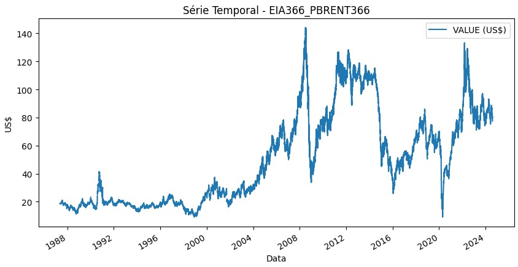

# Overview

O Instituto de Pesquisa Econômica Aplicada (IPEA) disponibiliza uma vasta gama de dados econômicos que podem ser utilizados para análise e previsão de séries temporais. Este case aborda a aplicação de ML para previsão de séries temporais utilizando dados do IPEA. 

Nesse case será mostrado na prática como realizar engenharia de features através de um processo de ETL, .

Há disponível uma biblioteca do python para acessar dados de séries temporais do IPEA o qual será usado nesse case: [https://pypi.org/project/ipeadatapy/](https://pypi.org/project/ipeadatapy/)

A série temporal que será utilizada será de preço por barril do petróleo bruto Brent (FOB) com código `EIA366_PBRENT366`, é uma série temporal com dados diários desde 04/01/1986.

# Obtenção dos dados do IPEA

No notebook criado `etl.ipynb` instale a biblioteca do IPEA para obtenção da série temporal em uma célula do notebook:

```python
!pip install ipeadatapy
```

Depois de instalar, importar a biblioteca em uma nova célula do notebook:

```python
import ipeadatapy as ip
```

Para buscar as séries temporais disponíveis, usar a função list_series:

```python
series = ip.list_series()
print(series)
```

É esperado o seguinte retorno do print:

```
  CODE                                               NAME
0            ABATE_ABPEAV                   Abate - aves - peso das carcaças
1            ABATE_ABPEBV                Abate - bovinos - peso das carcaças
2            ABATE_ABPESU                 Abate - suínos - peso das carcaças
3            ABATE_ABQUAV                          Abate - aves - quantidade
4            ABATE_ABQUBV                       Abate - bovinos - quantidade
...                   ...                                                ...
5139  PNADCT_TXPARTCUF_SI  Taxa de participação - sem instrução ou equiva...
5140           PNAD_IAGRV         Domicílios com insegurança alimentar grave
5141           PNAD_IALEV          Domicílios com insegurança alimentar leve
5142           PNAD_IAMOD      Domicílios com insegurança alimentar moderada
5143           PNAD_SATOT                 Domicílios com segurança alimentar

[5144 rows x 2 columns]
```

Para obter dados de uma série específica, é necessário saber o código da série. É possível encontrar o código no site do IPEA ou na lista de séries. 

Nesse case vamos usar o preço por barril do petróleo bruto Brent (FOB), o qual tem o código `EIA366_PBRENT366`.

Com o código em mãos, é só usar a função `timeseries` da biblioteca `ipeadatapy` para obter os dados, como demonstrado a seguir.

```python
cod = "EIA366_PBRENT366"
eia366 = ip.timeseries(cod)
print(eia366.head(5))
```

É esperado o seguinte retorno do print:

```
                        CODE                   RAW DATE  DAY  MONTH  YEAR  \
DATE                                                                        
1986-01-04  EIA366_PBRENT366  1986-01-04T00:00:00-02:00    4      1  1986   
1986-01-05  EIA366_PBRENT366  1986-01-05T00:00:00-02:00    5      1  1986   
1986-01-06  EIA366_PBRENT366  1986-01-06T00:00:00-02:00    6      1  1986   
1986-01-07  EIA366_PBRENT366  1986-01-07T00:00:00-02:00    7      1  1986   
1986-01-08  EIA366_PBRENT366  1986-01-08T00:00:00-02:00    8      1  1986   

            VALUE (US$)  
DATE                     
1986-01-04          NaN  
1986-01-05          NaN  
1986-01-06          NaN  
1986-01-07          NaN  
1986-01-08          NaN  
```

Para visualizar a série temporal obtida:

```python
import matplotlib.pyplot as plt

# plota os dados
eia366[["VALUE (US$)"]].plot(figsize=(10, 5))
plt.title("Série Temporal - EIA366_PBRENT366")
plt.xlabel("Data")
plt.ylabel("US$")
plt.show()
```

<div align="center">
  <figure>
    
    <figcaption>
      Fonte: Elaboração própria
    </figcaption>
  </figure>
</div>