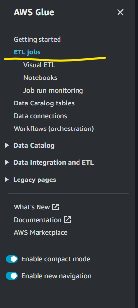
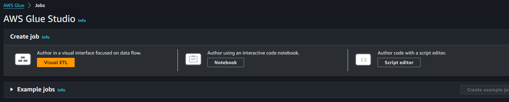
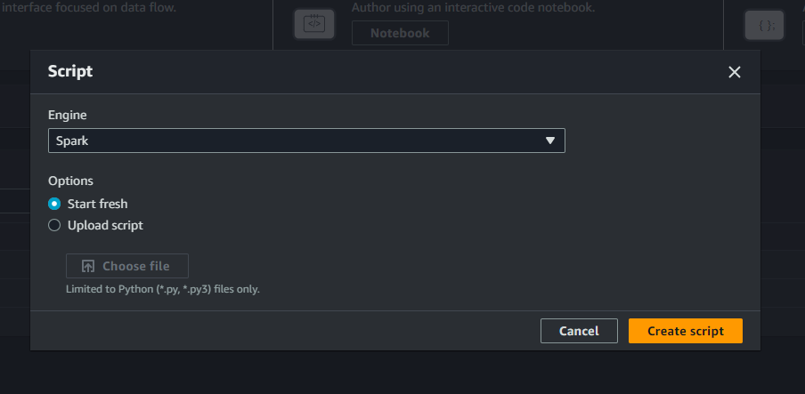
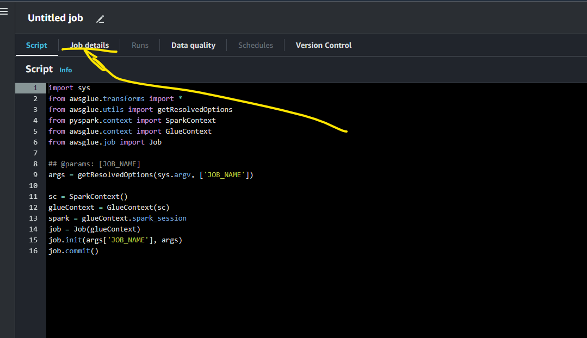
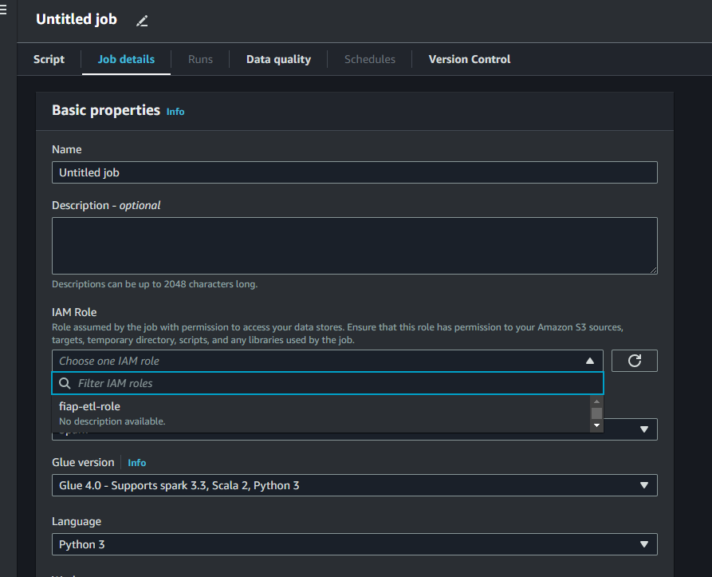
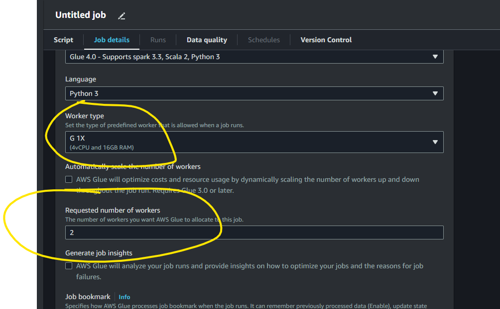
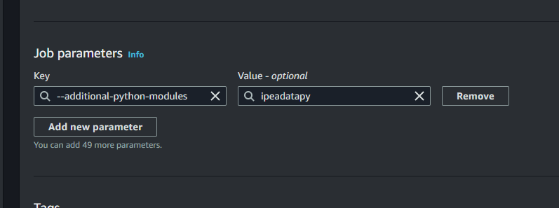
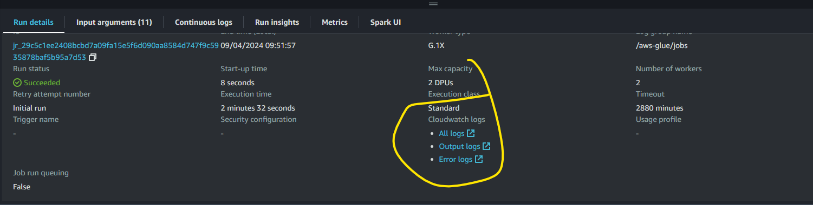
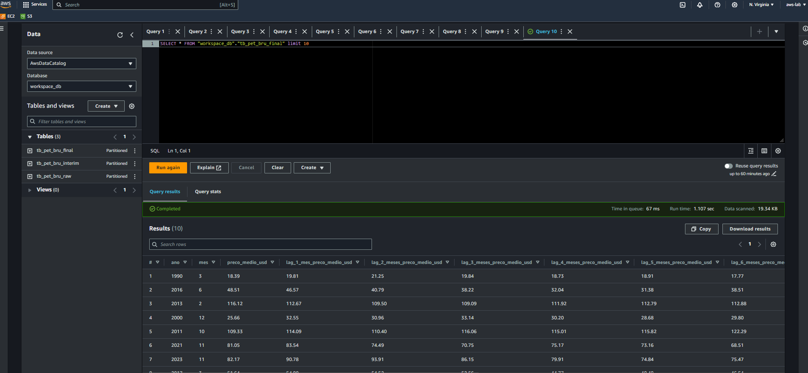

# AWS Glue

Aqui criaremos 3 jobs Glue para o processo de ETL, o `extract`, `transform` e `load`, para isso acessamos o console do Glue na AWS e clicamos *ETL jobs*:

<div align="center">
  <figure>
    
    <figcaption>
      Fonte: Elaboração própria
    </figcaption>
  </figure>
</div>

Depois em *Script editor*:

<div align="center">
  <figure>
    
    <figcaption>
      Fonte: Elaboração própria
    </figcaption>
  </figure>
</div>

Definimos a *engine* como *Pyspark*:

<div align="center">
  <figure>
    
    <figcaption>
      Fonte: Elaboração própria
    </figcaption>
  </figure>
</div>

O job será criado e acessamos a aba *Job details*:

<div align="center">
  <figure>
    
    <figcaption>
      Fonte: Elaboração própria
    </figcaption>
  </figure>
</div>

Aqui é definido o nome do job que será `extract`, e a *role* que foi criada na parte de set up da parte 2:

<div align="center">
  <figure>
    
    <figcaption>
      Fonte: Elaboração própria
    </figcaption>
  </figure>
</div>

Ainda em *Job details* é necessário definir o *Worker type* como `G 1X`, *Requested number of workers* com o mínimo possível que é 2 (esse parâmetro deve ser ajustado conforme necessidade), e como usaremos a biblioteca `ipeaddatapy` é necessário criar o parâmetro para possibilitar seu uso:

<div align="center">
  <figure>
    
  </figure>
</div>

<div align="center">
  <figure>
    
    <figcaption>
      Fonte: Elaboração própria
    </figcaption>
  </figure>
</div>

Volatmos para a aba *Script* e colocamos o seguinte código:

```python
import sys
import logging
import boto3
from awsglue.context import GlueContext
from awsglue.utils import getResolvedOptions
from awsglue.job import Job
from pyspark.context import SparkContext
import ipeadatapy as ip
from pyspark.sql.functions import current_date, date_format

# configura o Logger
logger = logging.getLogger()
logger.setLevel(logging.INFO)

console_handler = logging.StreamHandler()
console_handler.setLevel(logging.INFO)
formatter = logging.Formatter('%(asctime)s - %(name)s - %(levelname)s - %(message)s')
console_handler.setFormatter(formatter)
logger.addHandler(console_handler)

# parâmetros de execução do Glue (se houver)
args = getResolvedOptions(sys.argv, ['JOB_NAME'])

# configura o SparkContext e o GlueContext
sc = SparkContext()
glueContext = GlueContext(sc)
spark = glueContext.spark_session

# inicializando o job Glue
job = Job(glueContext)
job.init(args['JOB_NAME'], args)

# obtenção da série temporal do preço do petróleo bruto
cod = "EIA366_PBRENT366"
eia366 = ip.timeseries(cod)

# converte de pandas DataFrame para DataFrame do PySpark
df = spark.createDataFrame(eia366)

# renomeia as colunas para corresponder aos nomes esperados
df = df.withColumnRenamed("CODE", "code") \
       .withColumnRenamed("RAW DATE", "raw_date") \
       .withColumnRenamed("DAY", "day") \
       .withColumnRenamed("MONTH", "month") \
       .withColumnRenamed("YEAR", "year") \
       .withColumnRenamed("VALUE (US$)", "value_usd")

# coluna de data de processamento no formato "yyyyMMdd"
df = df.withColumn("dataproc", date_format(current_date(), "yyyyMMdd").cast("int"))

# log do schema do DataFrame
logger.info("Schema do DataFrame:")
df.printSchema()

# log de count e log do número de registros no DataFrame
record_count = df.count()
logger.info(f"Número de registros no DataFrame: {record_count}")

# diretório S3 para salvar os dados brutos particionados
raw_data_path = "s3://fiap-etl/raw/"

# salva os dados brutos em formato parquet no S3, particionando por data de processamento
df.write.mode("overwrite").partitionBy("dataproc").parquet(raw_data_path)

# cliente do boto3 para Glue
glue_client = boto3.client("glue")

database_name = "workspace_db"
table_name = "tb_pet_bru_raw"
table_location = raw_data_path

# verifica se o banco de dados existe e crie se necessário
try:
    glue_client.get_database(Name=database_name)
except glue_client.exceptions.EntityNotFoundException:
    glue_client.create_database(
        DatabaseInput={'Name': database_name}
    )
    logger.info(f"Banco de dados '{database_name}' criado no Glue Catalog.")

# definição da tabela
table_input = {
    'Name': table_name,
    'StorageDescriptor': {
        'Columns': [
            {"Name": "code", "Type": "string"},
            {"Name": "raw_date", "Type": "string"},
            {"Name": "day", "Type": "bigint"},
            {"Name": "month", "Type": "bigint"},
            {"Name": "year", "Type": "bigint"},
            {"Name": "value_usd", "Type": "double"}
        ],
        'Location': table_location,
        'InputFormat': 'org.apache.hadoop.hive.ql.io.parquet.MapredParquetInputFormat',
        'OutputFormat': 'org.apache.hadoop.hive.ql.io.parquet.MapredParquetOutputFormat',
        'Compressed': False,
        'SerdeInfo': {
            'SerializationLibrary': 'org.apache.hadoop.hive.ql.io.parquet.serde.ParquetHiveSerDe',
            'Parameters': {'serialization.format': '1'}
        }
    },
    'PartitionKeys': [{"Name": "dataproc", "Type": "int"}],
    'TableType': 'EXTERNAL_TABLE'
}

# cria ou atualiza a tabela no Glue Catalog
try:
    glue_client.get_table(DatabaseName=database_name, Name=table_name)
    logger.info(f"Tabela '{table_name}' já existe no Glue Catalog. Atualizando tabela...")
    glue_client.update_table(DatabaseName=database_name, TableInput=table_input)
    logger.info(f"Tabela '{table_name}' atualizada no Glue Catalog.")
except glue_client.exceptions.EntityNotFoundException:
    glue_client.create_table(DatabaseName=database_name, TableInput=table_input)
    logger.info(f"Tabela '{table_name}' criada no Glue Catalog.")

logger.info(f"Tabela '{table_name}' disponível no Athena.")

# executa MSCK REPAIR TABLE para descobrir partições
repair_table_query = f"MSCK REPAIR TABLE {database_name}.{table_name}"
logger.info(f"Executando comando: {repair_table_query}")
spark.sql(repair_table_query)
logger.info(f"Comando MSCK REPAIR TABLE executado com sucesso para a tabela '{table_name}'.")

# finaliza o job Glue
job.commit()

```

Fazemos o mesmo para criar o job `transform` com o seguinte código:

```python
import sys
import logging
import boto3
from awsglue.context import GlueContext
from awsglue.utils import getResolvedOptions
from awsglue.job import Job
from pyspark.context import SparkContext
from pyspark.sql.functions import (
    avg, 
    col, 
    concat,
    current_date,
    date_format,
    lag,
    lpad,
    max,
    min,
    quarter,
    stddev,
    to_date
)
from pyspark.sql.window import Window

# configura o Logger
logger = logging.getLogger()
logger.setLevel(logging.INFO)

console_handler = logging.StreamHandler()
console_handler.setLevel(logging.INFO)
formatter = logging.Formatter('%(asctime)s - %(name)s - %(levelname)s - %(message)s')
console_handler.setFormatter(formatter)
logger.addHandler(console_handler)

# parâmetros de execução do Glue (se houver)
args = getResolvedOptions(sys.argv, ['JOB_NAME'])

# configura o SparkContext e o GlueContext
sc = SparkContext()
glueContext = GlueContext(sc)
spark = glueContext.spark_session

# inicializando o job Glue
job = Job(glueContext)
job.init(args['JOB_NAME'], args)

# lendo os dados da tabela do Glue Catalog com a partição mais recente
database_name = "workspace_db"
table_name = "tb_pet_bru_raw"

dyf = glueContext.create_dynamic_frame.from_catalog(database=database_name, table_name=table_name)
df = dyf.toDF()

most_recent_partition = df.agg({"dataproc": "max"}).collect()[0][0]
df = df.filter(col("dataproc") == most_recent_partition)

# log do schema do DataFrame
logger.info("Schema do DataFrame após leitura da tabela:")
df.printSchema()

# obtendo o ano e mês corrente
current_year = date_format(current_date(), "yyyy").cast("int")
current_month = date_format(current_date(), "MM").cast("int")

# filtro para remover os dados do mês corrente
df = df.filter(~((col("year") == current_year) & (col("month") == current_month)))

# remove registros com valores ausentes em "value_usd"
df = df.na.drop(subset=["value_usd"])

# média mensal de preço do petróleo bruto
df = df.groupBy("year", "month").agg(avg("value_usd").alias("preco_medio_usd"))

# cria a coluna "anomes" utilizando os campos "year" e "month"
df = df.withColumn("anomes", to_date(concat(col("year").cast("string"), lpad(col("month").cast("string"), 2, "0")), "yyyyMM"))

# ordena o DataFrame por data
window_spec = Window.orderBy("anomes")

# cria lags de 1 a 6 meses
df = df.withColumn("lag_1_mes_preco_medio_usd", lag("preco_medio_usd", 1).over(window_spec)) \
       .withColumn("lag_2_meses_preco_medio_usd", lag("preco_medio_usd", 2).over(window_spec)) \
       .withColumn("lag_3_meses_preco_medio_usd", lag("preco_medio_usd", 3).over(window_spec)) \
       .withColumn("lag_4_meses_preco_medio_usd", lag("preco_medio_usd", 4).over(window_spec)) \
       .withColumn("lag_5_meses_preco_medio_usd", lag("preco_medio_usd", 5).over(window_spec)) \
       .withColumn("lag_6_meses_preco_medio_usd", lag("preco_medio_usd", 6).over(window_spec))

# média móvel de 6 meses
df = df.withColumn("media_movel_6_meses_preco_medio_usd", avg(col("preco_medio_usd")).over(window_spec.rowsBetween(-6, -1)))

# desvio padrão móvel de 6 meses
df = df.withColumn("desvio_padrao_movel_6_meses_preco_medio_usd", stddev(col("preco_medio_usd")).over(window_spec.rowsBetween(-6, -1)))

# valor mínimo e máximo dos últimos 6 meses
df = df.withColumn("valor_minimo_6_meses_preco_medio_usd", min(col("preco_medio_usd")).over(window_spec.rowsBetween(-6, -1))) \
       .withColumn("valor_maximo_6_meses_preco_medio_usd", max(col("preco_medio_usd")).over(window_spec.rowsBetween(-6, -1)))

# componentes sazonais: ano, mês e trimestre
df = df.withColumn("trimestre", quarter("anomes"))
df = df.withColumnRenamed("year", "ano")
df = df.withColumnRenamed("month", "mes")

# cria a coluna de partição "dataproc" no formato "yyyyMMdd"
df = df.withColumn("dataproc", date_format(current_date(), "yyyyMMdd").cast("int"))

# remove o campo "anomes"
df = df.drop("anomes")

# remove linhas com valores NaN que foram criados ao fazer o shift ou nas agregações
df = df.dropna()

# log de count e número de registros no DataFrame transformado
transformed_record_count = df.count()
logger.info(f"Número de registros no DataFrame transformado: {transformed_record_count}")

# diretório S3 para salvar os dados transformados
transformed_data_path = "s3://fiap-etl/interim/"

# salva os dados transformados em formato parquet no S3, particionando por data de processamento
df.write.mode("overwrite").partitionBy("dataproc").parquet(transformed_data_path)

# cliente do boto3 para Glue
glue_client = boto3.client("glue")

# define o nome do database e tabela para os dados transformados
database_name = "workspace_db"
transformed_table_name = "tb_pet_bru_interim"
transformed_table_location = transformed_data_path

# verifica se o banco de dados existe e cria se necessário
try:
    glue_client.get_database(Name=database_name)
except glue_client.exceptions.EntityNotFoundException:
    glue_client.create_database(
        DatabaseInput={'Name': database_name}
    )
    logger.info(f"Banco de dados '{database_name}' criado no Glue Catalog.")

# definição da tabela transformada com partição
transformed_table_input = {
    'Name': transformed_table_name,
    'StorageDescriptor': {
        'Columns': [
            {"Name": "ano", "Type": "bigint"},
            {"Name": "mes", "Type": "bigint"},
            {"Name": "preco_medio_usd", "Type": "double"},
            {"Name": "lag_1_mes_preco_medio_usd", "Type": "double"},
            {"Name": "lag_2_meses_preco_medio_usd", "Type": "double"},
            {"Name": "lag_3_meses_preco_medio_usd", "Type": "double"},
            {"Name": "lag_4_meses_preco_medio_usd", "Type": "double"},
            {"Name": "lag_5_meses_preco_medio_usd", "Type": "double"},
            {"Name": "lag_6_meses_preco_medio_usd", "Type": "double"},
            {"Name": "media_movel_6_meses_preco_medio_usd", "Type": "double"},
            {"Name": "desvio_padrao_movel_6_meses_preco_medio_usd", "Type": "double"},
            {"Name": "valor_minimo_6_meses_preco_medio_usd", "Type": "double"},
            {"Name": "valor_maximo_6_meses_preco_medio_usd", "Type": "double"},
            {"Name": "trimestre", "Type": "int"}
        ],
        'Location': transformed_table_location,
        'InputFormat': 'org.apache.hadoop.hive.ql.io.parquet.MapredParquetInputFormat',
        'OutputFormat': 'org.apache.hadoop.hive.ql.io.parquet.MapredParquetOutputFormat',
        'Compressed': False,
        'SerdeInfo': {
            'SerializationLibrary': 'org.apache.hadoop.hive.ql.io.parquet.serde.ParquetHiveSerDe',
            'Parameters': {'serialization.format': '1'}
        }
    },
    'PartitionKeys': [{"Name": "dataproc", "Type": "int"}],  # Particionando por dataproc
    'TableType': 'EXTERNAL_TABLE'
}

# cria ou atualiza a tabela transformada no Glue Catalog
try:
    glue_client.get_table(DatabaseName=database_name, Name=transformed_table_name)
    logger.info(f"Tabela '{transformed_table_name}' já existe no Glue Catalog. Atualizando tabela...")
    glue_client.update_table(DatabaseName=database_name, TableInput=transformed_table_input)
    logger.info(f"Tabela '{transformed_table_name}' atualizada no Glue Catalog.")
except glue_client.exceptions.EntityNotFoundException:
    glue_client.create_table(DatabaseName=database_name, TableInput=transformed_table_input)
    logger.info(f"Tabela '{transformed_table_name}' criada no Glue Catalog.")

logger.info(f"Tabela '{transformed_table_name}' disponível no Athena.")

# executa MSCK REPAIR TABLE para descobrir partições
repair_table_query = f"MSCK REPAIR TABLE {database_name}.{transformed_table_name}"
logger.info(f"Executando comando: {repair_table_query}")
spark.sql(repair_table_query)
logger.info(f"Comando MSCK REPAIR TABLE executado com sucesso para a tabela '{transformed_table_name}'.")

# finaliza o job Glue
job.commit()

```

E por fim o Glue job `load`:

```python
import sys
import logging
import boto3
from awsglue.context import GlueContext
from awsglue.utils import getResolvedOptions
from awsglue.job import Job
from pyspark.context import SparkContext
from pyspark.sql.functions import col, current_date, date_format
from pyspark.sql.types import DecimalType, IntegerType

# configura o Logger
logger = logging.getLogger()
logger.setLevel(logging.INFO)

console_handler = logging.StreamHandler()
console_handler.setLevel(logging.INFO)
formatter = logging.Formatter('%(asctime)s - %(name)s - %(levelname)s - %(message)s')
console_handler.setFormatter(formatter)
logger.addHandler(console_handler)

# parâmetros de execução do Glue (se houver)
args = getResolvedOptions(sys.argv, ['JOB_NAME'])

# configura o SparkContext e o GlueContext
sc = SparkContext()
glueContext = GlueContext(sc)
spark = glueContext.spark_session

# inicializando o job Glue
job = Job(glueContext)
job.init(args['JOB_NAME'], args)

# lendo os dados da tabela transformada do Glue Catalog
database_name = "workspace_db"
transformed_table_name = "tb_pet_bru_interim"

dyf = glueContext.create_dynamic_frame.from_catalog(database=database_name, table_name=transformed_table_name)
df = dyf.toDF()

most_recent_partition = df.agg({"dataproc": "max"}).collect()[0][0]
df = df.filter(col("dataproc") == most_recent_partition)

# log do schema do DataFrame após leitura da partição mais recente
logger.info("Schema do DataFrame após leitura da partição mais recente:")
df.printSchema()

# log de count e número de registros no DataFrame após filtrar a partição mais recente
logger.info(f"Número de registros após filtrar a partição mais recente: {df.count()}")

# forçando os tipos de dados
df = df.select(
    col("ano").cast(IntegerType()),
    col("mes").cast(IntegerType()),
    col("preco_medio_usd").cast(DecimalType(5, 2)),
    col("lag_1_mes_preco_medio_usd").cast(DecimalType(5, 2)),
    col("lag_2_meses_preco_medio_usd").cast(DecimalType(5, 2)),
    col("lag_3_meses_preco_medio_usd").cast(DecimalType(5, 2)),
    col("lag_4_meses_preco_medio_usd").cast(DecimalType(5, 2)),
    col("lag_5_meses_preco_medio_usd").cast(DecimalType(5, 2)),
    col("lag_6_meses_preco_medio_usd").cast(DecimalType(5, 2)),
    col("media_movel_6_meses_preco_medio_usd").cast(DecimalType(5, 2)),
    col("desvio_padrao_movel_6_meses_preco_medio_usd").cast(DecimalType(5, 2)),
    col("valor_minimo_6_meses_preco_medio_usd").cast(DecimalType(5, 2)),
    col("valor_maximo_6_meses_preco_medio_usd").cast(DecimalType(5, 2)),
    col("trimestre").cast(IntegerType()),
    col("dataproc").cast(IntegerType())
)

# log do schema do DataFrame após a conversão de tipos
logger.info("Schema do DataFrame após a conversão de tipos:")
df.printSchema()

# cria a coluna "dataproc" no formato "yyyyMMdd" para particionamento
df = df.withColumn("dataproc", date_format(current_date(), "yyyyMMdd").cast("int"))

# log de count e número de registros no DataFrame final
final_record_count = df.count()
logger.info(f"Número de registros no DataFrame final: {final_record_count}")

# diretório S3 para salvar os dados finais prontos para consumo
final_data_path = "s3://fiap-etl/final/"

# salva os dados finais em formato parquet no S3, particionando por data de processamento
df.write.mode("overwrite").partitionBy("dataproc").parquet(final_data_path)

# cliente do boto3 para Glue
glue_client = boto3.client("glue")

# define o nome do database e tabela para os dados finais
final_table_name = "tb_pet_bru_final"
final_table_location = final_data_path

# verifica se o banco de dados existe e cria se necessário
try:
    glue_client.get_database(Name=database_name)
except glue_client.exceptions.EntityNotFoundException:
    glue_client.create_database(
        DatabaseInput={'Name': database_name}
    )
    logger.info(f"Banco de dados '{database_name}' criado no Glue Catalog.")

# definição da tabela final com partição
final_table_input = {
    'Name': final_table_name,
    'StorageDescriptor': {
        'Columns': [
            {"Name": "ano", "Type": "int"},
            {"Name": "mes", "Type": "int"},
            {"Name": "preco_medio_usd", "Type": "decimal(5,2)"},
            {"Name": "lag_1_mes_preco_medio_usd", "Type": "decimal(5,2)"},
            {"Name": "lag_2_meses_preco_medio_usd", "Type": "decimal(5,2)"},
            {"Name": "lag_3_meses_preco_medio_usd", "Type": "decimal(5,2)"},
            {"Name": "lag_4_meses_preco_medio_usd", "Type": "decimal(5,2)"},
            {"Name": "lag_5_meses_preco_medio_usd", "Type": "decimal(5,2)"},
            {"Name": "lag_6_meses_preco_medio_usd", "Type": "decimal(5,2)"},
            {"Name": "media_movel_6_meses_preco_medio_usd", "Type": "decimal(5,2)"},
            {"Name": "desvio_padrao_movel_6_meses_preco_medio_usd", "Type": "decimal(5,2)"},
            {"Name": "valor_minimo_6_meses_preco_medio_usd", "Type": "decimal(5,2)"},
            {"Name": "valor_maximo_6_meses_preco_medio_usd", "Type": "decimal(5,2)"},
            {"Name": "trimestre", "Type": "int"}
        ],
        'Location': final_table_location,
        'InputFormat': 'org.apache.hadoop.hive.ql.io.parquet.MapredParquetInputFormat',
        'OutputFormat': 'org.apache.hadoop.hive.ql.io.parquet.MapredParquetOutputFormat',
        'Compressed': False,
        'SerdeInfo': {
            'SerializationLibrary': 'org.apache.hadoop.hive.ql.io.parquet.serde.ParquetHiveSerDe',
            'Parameters': {'serialization.format': '1'}
        }
    },
    'PartitionKeys': [{"Name": "dataproc", "Type": "int"}],  # Particionando por dataproc
    'TableType': 'EXTERNAL_TABLE'
}

# cria ou atualiza a tabela final no Glue Catalog
try:
    glue_client.get_table(DatabaseName=database_name, Name=final_table_name)
    logger.info(f"Tabela '{final_table_name}' já existe no Glue Catalog. Atualizando tabela...")
    glue_client.update_table(DatabaseName=database_name, TableInput=final_table_input)
    logger.info(f"Tabela '{final_table_name}' atualizada no Glue Catalog.")
except glue_client.exceptions.EntityNotFoundException:
    glue_client.create_table(DatabaseName=database_name, TableInput=final_table_input)
    logger.info(f"Tabela '{final_table_name}' criada no Glue Catalog.")

logger.info(f"Tabela '{final_table_name}' disponível no Athena.")

# executa MSCK REPAIR TABLE para descobrir partições
repair_table_query = f"MSCK REPAIR TABLE {database_name}.{final_table_name}"
logger.info(f"Executando comando: {repair_table_query}")
spark.sql(repair_table_query)
logger.info(f"Comando MSCK REPAIR TABLE executado com sucesso para a tabela '{final_table_name}'.")

# finaliza o job Glue
job.commit()

```

Com a criação de cada job, é possível executar o mesmo clicando no botão *Run*, na aba *Runs* e na aba *Run details*, é possível checar os logs de execução ou de falha em *Output logs* e *Error logs* respectivamente:

<div align="center">
  <figure>
    
    <figcaption>
      Fonte: Elaboração própria
    </figcaption>
  </figure>
</div>

Um ponto importante é que conseguimos acessar as tabelas criadas via Athena:

<div align="center">
  <figure>
    
    <figcaption>
      Fonte: Elaboração própria
    </figcaption>
  </figure>
</div>
