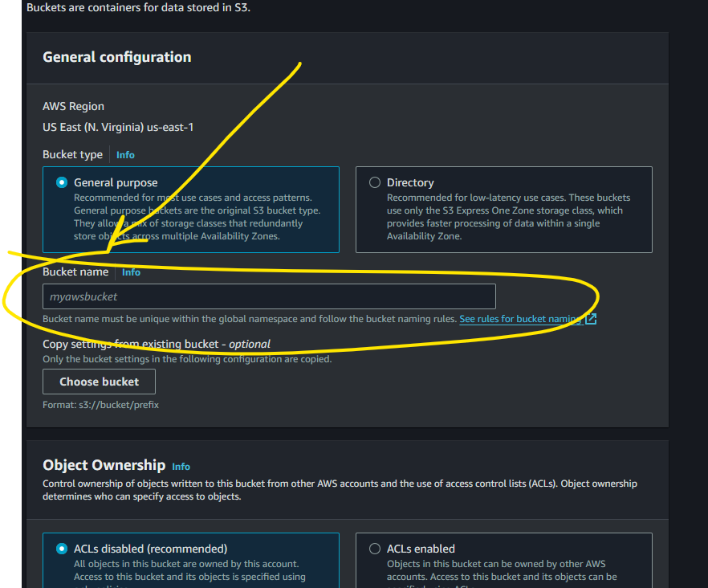
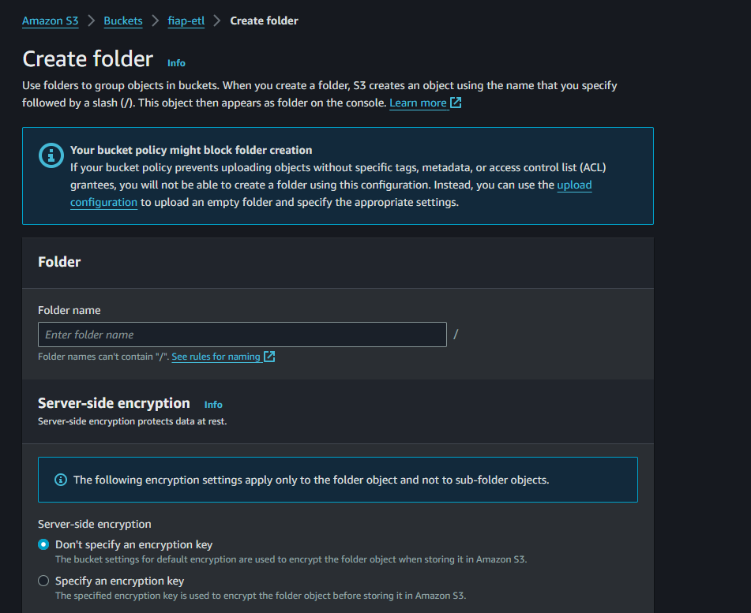
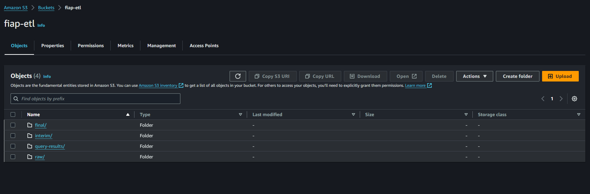

# Buckets S3

Agora criaremos o *bucket* e respectivos paths que serão usados nesse hands-on, no console do S3 clicamos no botão *Create bucket*, o nome do *bucket* será `fiap-etl`:

  <figure>
    
    <figcaption>
      Fonte: Elaboração própria
    </figcaption>
  </figure>

Com o bucket criado, acessar o mesmo e criar os diretórios, `raw`, `interim`, `final` e `query-results` clicando no botão *Create folder*:

  <figure>
    
    <figcaption>
      Fonte: Elaboração própria
    </figcaption>
  </figure>

É esperado os paths no bucket:

  <figure>
    
    <figcaption>
      Fonte: Elaboração própria
    </figcaption>
  </figure>

O path `query-results` será utilizado pelo Athena para armazenar as queries.