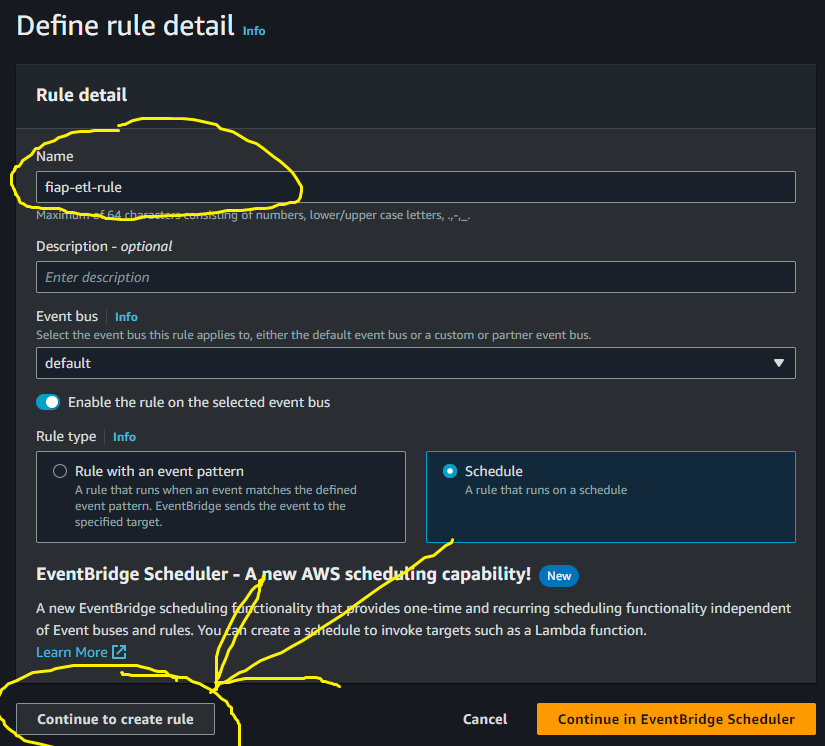
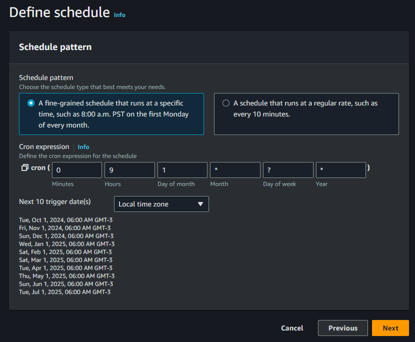
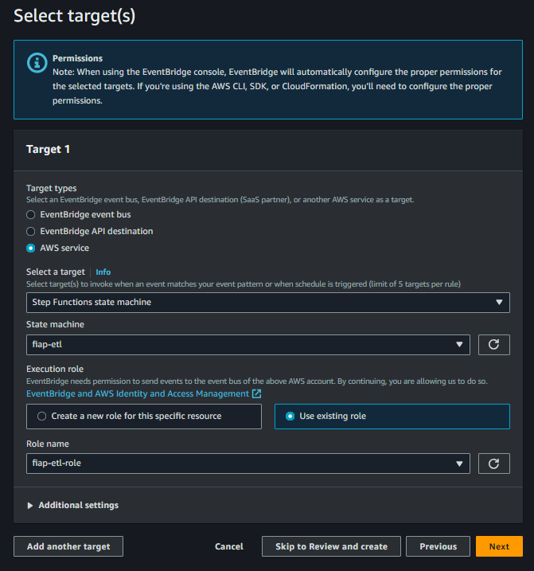

# EventBridge

O EventBridge pode ser usado para agendar a execução da máquina de estado. Para isso acessamos o console do EventBridge e na aba esquerda clicamos em *Rules*, e depois em *Create rule*, definimos o nome da regra:

  <figure>
    
    <figcaption>
      Fonte: Elaboração própria
    </figcaption>
  </figure>

Definimos a CRON para execução do mesmo:

  <figure>
    
    <figcaption>
      Fonte: Elaboração própria
    </figcaption>
  </figure>

Depois definimos a *role*, definimos qual serviço da AWS ela vai ser aplicada (no caso será nossa máquina de estado `fiap-etl`), e clicamos em *Next* para criar a regra no EventBridge.

  <figure>
    
    <figcaption>
      Fonte: Elaboração própria
    </figcaption>
  </figure>

Para efeito de teste, defina um CRON para execução próximo do horário atual para testar a execução.