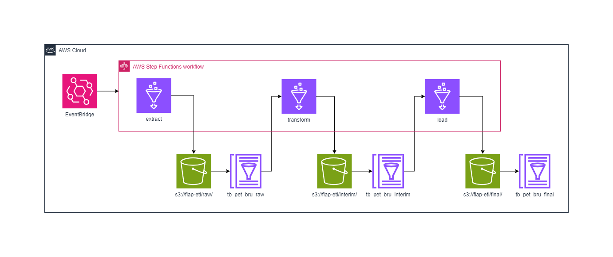
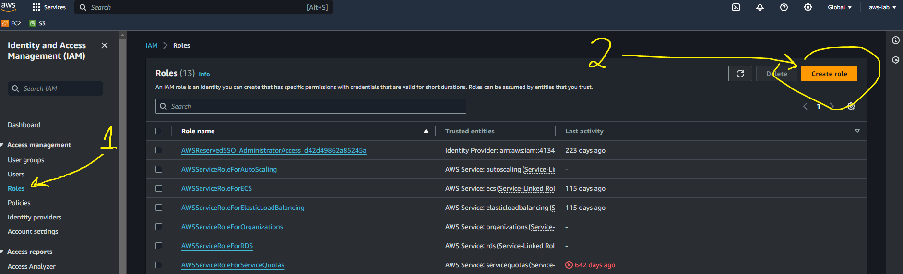
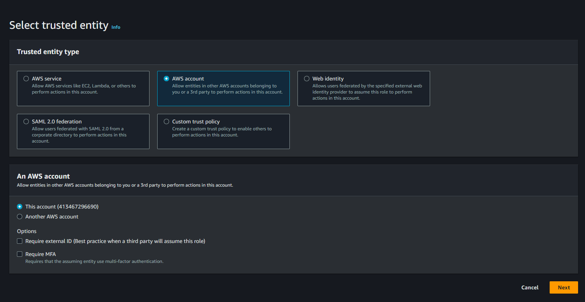
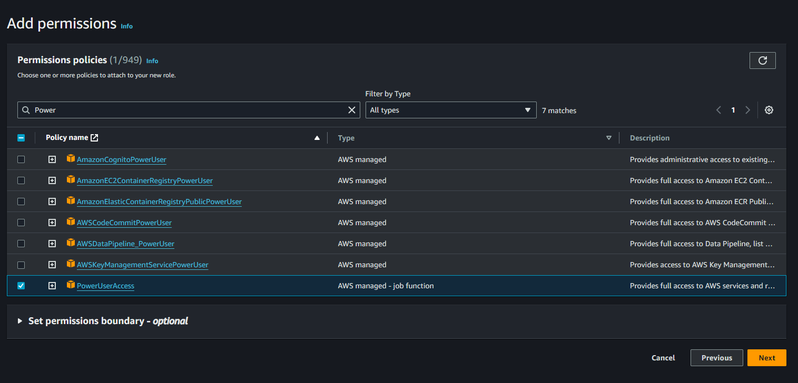
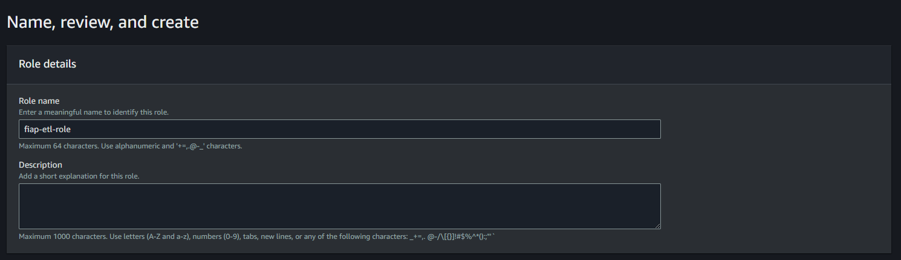

# Set up e arquitetura para a parte 2

Para a parte 2 do hands-on de ETL com AWS é necessário ter uma conta da AWS.

A arquitetura que será implementada será a seguinte:

<div align="center">
  <figure>
    
    <figcaption>
      Fonte: Elaboração própria
    </figcaption>
  </figure>
</div>

A arquitetura utiliza os seguintes serviços da AWS:

**EventBridge**: Este serviço é usado para iniciar a execução agendada da máquina de estado do Step Functions.

**AWS Step Functions**: Serviço de orquestração que coordena e gerencia o fluxo de tarefas em um aplicativo. O Step Functions aqui é usado para gerenciar um fluxo de trabalho ETL.

**Amazon S3 (Simple Storage Service)**: O S3 é usado para armazenar dados em diferentes estágios do processo ETL:
   - `s3://fiap-etl/raw/`: Armazena os dados brutos extraídos.
   - `s3://fiap-etl/interim/`: Armazena os dados transformados.
   - `s3://fiap-etl/final/`: Armazena os dados finais, prontos para consumo.

**Cátalogo de dados do Glue**: Tabelas `tb_pet_bru_raw`, `tb_pet_bru_interim` e `tb_pet_bru_final` dos diferentes estágios do processo ETL.

É necessário criar uma *role* do IAM (Identity and Access Management), definir a *policy* e respectiva *trust relantionship* para que esses serviços da AWS possam utilizar essa *role*, conforme demonstrado a seguir.

Acessar o console do IAM na AWS:

<div align="center">
  <figure>
    
    <figcaption>
      Fonte: Elaboração própria
    </figcaption>
  </figure>
</div>

Vamos criar uma *role* chamada `fiap-etl-role`:

<div align="center">
  <figure>
    
    <figcaption>
      Fonte: Elaboração própria
    </figcaption>
  </figure>
</div>

Aqui definimos a *policy* da AWS `PowerUserAccess`:

<div align="center">
  <figure>
    
    <figcaption>
      Fonte: Elaboração própria
    </figcaption>
  </figure>
</div>

E aqui definimos o nome da *role*, agora é clicar no botão *Create role*:

<div align="center">
  <figure>
    
    <figcaption>
      Fonte: Elaboração própria
    </figcaption>
  </figure>
</div>

Com a role criada acesse a mesma via console, clique na aba *Trust relantionship*, clique em *Edit trust policy*, cole o seguinte json e clique em *Update policy*:

```json

{
	"Version": "2012-10-17",
	"Statement": [
		{
			"Effect": "Allow",
			"Principal": {
				"AWS": "arn:aws:iam::<id da conta da AWS>:<usuário>"
			},
			"Action": "sts:AssumeRole",
			"Condition": {}
		},
		{
			"Effect": "Allow",
			"Principal": {
				"Service": [
					"events.amazonaws.com",
					"states.amazonaws.com",
					"glue.amazonaws.com"
				]
			},
			"Action": "sts:AssumeRole"
		}
	]
}
```
