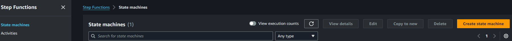
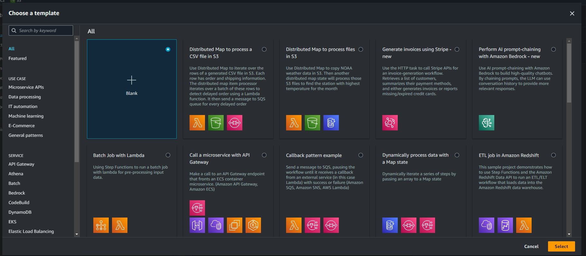
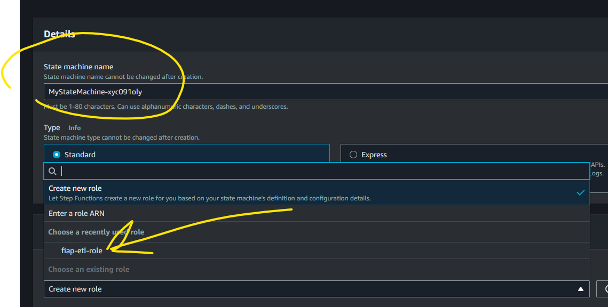
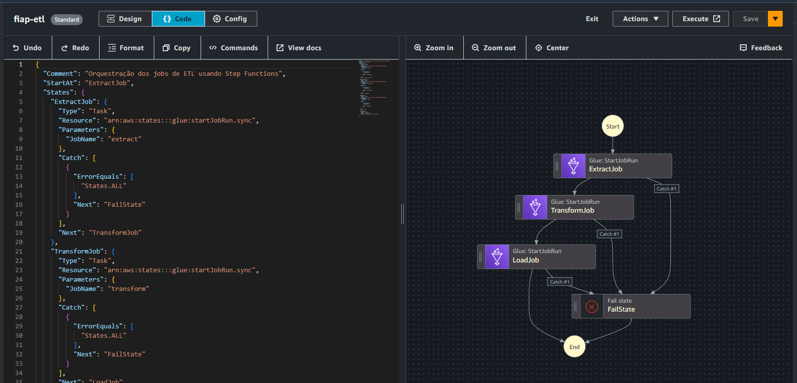
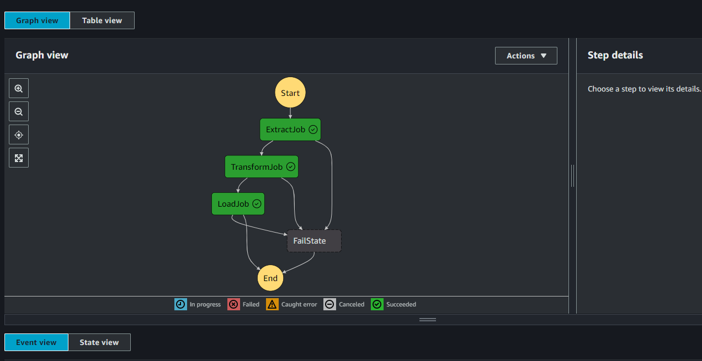

# Orquestração de ETL com AWS Step Functions

Para orquestrar a execução, será utilizado o Step Functions da AWS como já foi mencionado. Para isso, acessamos o console do Step Functions na AWS para criarmos uma máquina de estado e clicamos em *Create state machine*:

<div align="center">
  <figure>
    
    <figcaption>
      Fonte: Elaboração própria
    </figcaption>
  </figure>
</div>

Selecionar a seguinte opção:

<div align="center">
  <figure>
    
    <figcaption>
      Fonte: Elaboração própria
    </figcaption>
  </figure>
</div>

Na aba *Config*, definimos o nome da máquina de estado como `fiap-etl` e definimos a *role*:

<div align="center">
  <figure>
    
    <figcaption>
      Fonte: Elaboração própria
    </figcaption>
  </figure>
</div>

Vamos para a aba *Code*, e inserimos o a seguinte ASL (Amazon States Language):

```json

{
  "Comment": "Orquestração dos jobs de ETL usando Step Functions",
  "StartAt": "ExtractJob",
  "States": {
    "ExtractJob": {
      "Type": "Task",
      "Resource": "arn:aws:states:::glue:startJobRun.sync",
      "Parameters": {
        "JobName": "extract"
      },
      "Catch": [
        {
          "ErrorEquals": [
            "States.ALL"
          ],
          "Next": "FailState"
        }
      ],
      "Next": "TransformJob"
    },
    "TransformJob": {
      "Type": "Task",
      "Resource": "arn:aws:states:::glue:startJobRun.sync",
      "Parameters": {
        "JobName": "transform"
      },
      "Catch": [
        {
          "ErrorEquals": [
            "States.ALL"
          ],
          "Next": "FailState"
        }
      ],
      "Next": "LoadJob"
    },
    "LoadJob": {
      "Type": "Task",
      "Resource": "arn:aws:states:::glue:startJobRun.sync",
      "Parameters": {
        "JobName": "load"
      },
      "Catch": [
        {
          "ErrorEquals": [
            "States.ALL"
          ],
          "Next": "FailState"
        }
      ],
      "End": true
    },
    "FailState": {
      "Type": "Fail",
      "Error": "JobFailed",
      "Cause": "A execução do job falhou."
    }
  }
}
```

Com isso é gerado o diagrama:

<div align="center">
  <figure>
    
    <figcaption>
      Fonte: Elaboração própria
    </figcaption>
  </figure>
</div>

Clicar no botão *Save*, para chacar o funcionamento da máquina de estado, clicar em *Execute*, se concluído com sucesso o diagrama será apresentado da seguinte forma:

<div align="center">
  <figure>
    
    <figcaption>
      Fonte: Elaboração própria
    </figcaption>
  </figure>
</div>


